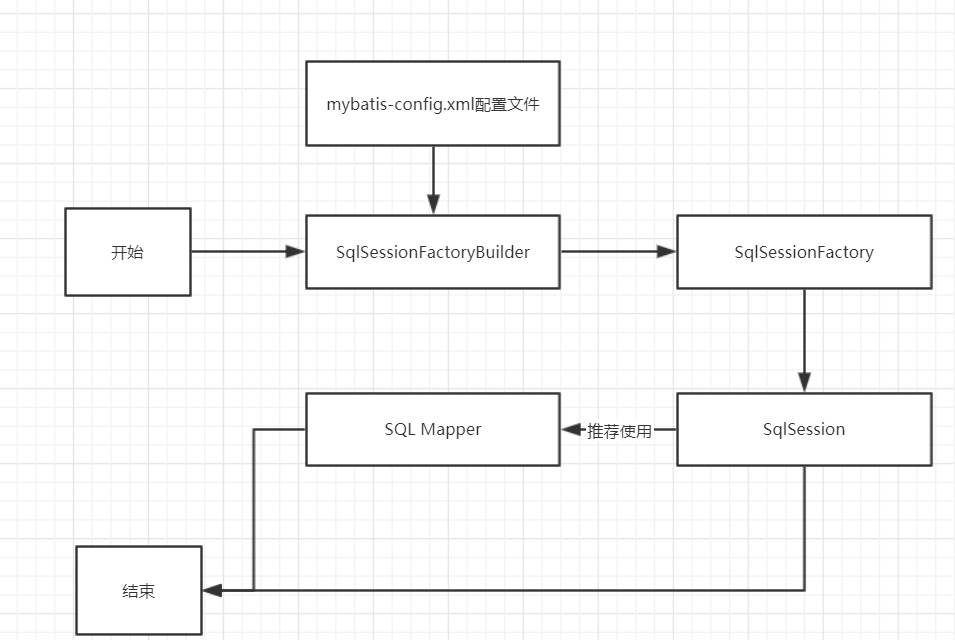
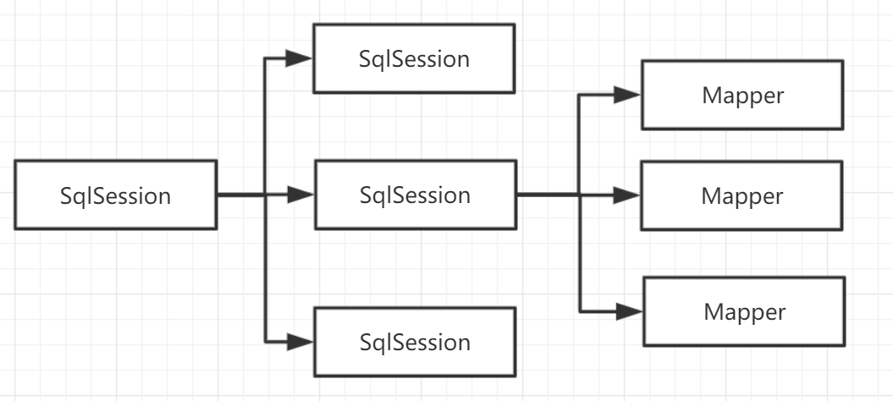

# Mybatis


## 3、CRUD

### 


### 7、万能map

```java
    int addUser2(Map<String, Object> map);
```

```java
    <insert id="addUser2" parameterType="map">

        insert into user (id, name, pwd) values (#{id}, #{name}, #{password})
    </insert>
```

```java
    //测试用 Map插入数据
    @Test
    public void TestAddUser2(){
        SqlSession sqlSession = MybatisUtils.getSqlSession();

        UserMapper mapper = sqlSession.getMapper(UserMapper.class);
        Map<String, Object> map = new HashMap<String, Object>();
        map.put("name", "map");
        map.put("id", 6);
        map.put("password", "1234567");

        int res = mapper.addUser2(map);
        if(res > 0){
            System.out.println(res);
            System.out.println("ok");
        }
        sqlSession.commit();
        sqlSession.close();
    }
```


Map传递参数，直接在sql中取出key即可【parameterType = "map"】

对象传递参数，直接在sql中取出对象属性即可

只有一个基本类型参数的情况下，可以直接在sql中取到！

多个参数用Map， **或者注解！**

### 8、思考题

模糊查询怎么写？？

​	1.Java代码执行的时候， 传递通配符 % %

```java
List<User> userList = mapper.getUserLike("%李%");
```

​	2.在sql拼接中使用通配符！（在sql中写死，   会有sql注入问题）

```java
select * from user where name like "%#{value}%"
```

## 4、配置解析

### 1、核心配置文件

- mybatis-config.xml

- MyBatis的配置文件包含了会深深影响Mybatis行为的设置和属性信息

  ```xml
  configuration（配置）
  properties（属性）
  settings（设置）
  typeAliases（类型别名）
  
  typeHandlers（类型处理器）
  objectFactory（对象工厂）
  plugins（插件）
  
  environments（环境配置）
  environment（环境变量）
  transactionManager（事务管理器）
  dataSource（数据源）
  databaseIdProvider（数据库厂商标识）
  mappers（映射器）
  ```


### 2、环境配置

Mybatis可以配置成适应多种环境

可以配置多套环境

**不过要记住：尽管可以配置多个环境，但每个 SqlSessionFactory 实例只能选择一种环境。**


Mybatis默认的事务管理器就是JDBC，  连接池： POOLED

### 3、属性（properties）

属性都是可外部配置且可动态替换的，既可以在典型的 Java 属性文件中配置，亦可通过 properties 元素的子元素来传递。【db.properties】

编写一个配置文件

```xml
driver=com.mysql.jdbc.Driver
url=jdbc:mysql://localhost:3306/mybatis?/useUnicoude=true&characterEncoding=utf-8&useSSL=false
username=root
password=123456
```

在核心配置文件中引入

```xml
<properties resource="db.properties">
        <property name="pwd" value="123456"/>
    </properties>
```

- 可以直接引入外部文件
- 可以在其中加入一些属性配置
- ==如果两个文件有同一个字段，优先使用外部配置文件中的属性==

### 4、typeAliases（类型别名）

类型别名是为 Java 类型设置一个短的名字

存在的意义仅在于用来减少类完全限定名的冗余

```xml
    <typeAliases>
        <typeAlias type="com.wang.pojo.User" alias="User"></typeAlias>
    </typeAliases>
```


也可以指定一个包名，MyBatis会在包名下面搜索需要的Java Bean

扫描实体类的包，它默认的别名就为这个类的 类名， 首字母小写！

```xml
<typeAliases>
        <typeAlias type="com.wang.pojo.User" alias="User"></typeAlias>
        <package name="com.wang.pojo"/>
    </typeAliases>
```


在实体类比较少的时候，使用第一种方式。

如果实体类十分多，建议使用第二种

第一种可以DIY别名，第二种则不行， 如果非要改， 需要在实体上加上注解 

```java
@Alias("user")
public class User{}
```

### 5、设置

………………

### 6、其他配置

……………………

### 7、映射器（mappers）

方式一：**推荐使用**

```xml
<!-- 使用相对于类路径的资源引用 -->
<mappers>
  <mapper resource="org/mybatis/builder/AuthorMapper.xml"/>
  <mapper resource="org/mybatis/builder/BlogMapper.xml"/>
  <mapper resource="org/mybatis/builder/PostMapper.xml"/>
</mappers>
```


方式二：**不推荐使用**

```xml
<!-- 使用完全限定资源定位符（URL） -->
<mappers>
  <mapper url="file:///var/mappers/AuthorMapper.xml"/>
  <mapper url="file:///var/mappers/BlogMapper.xml"/>
  <mapper url="file:///var/mappers/PostMapper.xml"/>
</mappers>
```


方式三：使用扫描包进行注入绑定

```xml
<!-- 使用映射器接口实现类的完全限定类名 -->
<mappers>
  <mapper class="org.mybatis.builder.AuthorMapper"/>
  <mapper class="org.mybatis.builder.BlogMapper"/>
  <mapper class="org.mybatis.builder.PostMapper"/>
</mappers>
```

**注意：接口和他的Mapper配置文件必须同名；   接口和他的Mapper配置文件必须在同一个包下**


方式四：

```xml
<!-- 将包内的映射器接口实现全部注册为映射器 -->
<mappers>
  <package name="org.mybatis.builder"/>
</mappers>
```


### 8、生命周期和作用域



生命周期和作用域是至关重要的，因为错误的使用会导致非常严重的**并发问题**

**SqlSessionFactoryBuilder**

一旦创建了SqlSessionFactory， 就不再需要它了，  所以应声明为局部变量

**SqlSessionFactory**

说白了就是可以想象为：  数据库连接池

SqlSessionFactory一旦被创建就应该在应用的运行期间一直存在，**没有任何理由丢弃它或重新创建另一个实例**

因此SqlSessionFactory的最佳作用域是应用作用域

最简单的就是使用**单例模式**或者静态代理模式

**SqlSession**

连接到连接池的一个请求

SqlSession 的实例不是线程安全的，因此是不能被共享的，所以它的最佳的作用域是请求或方法作用域。




这里的每一个Mapper， 就代表一个具体的业务


## 5、解决属性名和字段名不一致的问题

java实体类属性名 与 数据库字段不一致


解决办法：

**起别名**

```sql
select id,name, pwd as password from
```


### 1、resultMap

就是数据库中的一个列， 映射到java中的一个属性  column为数据库字段，   property为java中与之对应的属性

```xml
<resultMap id="UserMap" type="User">
        <result column="id" property="id"/>
        <result column="name" property="name"/>
        <result column="pwd" property="password"/>
    </resultMap>
    
    
    <select id="getUserList" resultType="User" resultMap="UserMap">
    select * from mybatis.user
    </select>
```


## 6、日志

### 6.1日志工厂

如果一个数据库操作，出现了异常， 我们需要排错。  日志就是最好的帮手！

曾经：sout、debug

现在：日志工厂


- SLF4J 
- **LOG4J**
- LOG4J2 
- JDK_LOGGING 
- COMMONS_LOGGING 
- **STDOUT_LOGGING** 
- NO_LOGGING


STDOUT_LOGGING

```xml
<settings>
    <setting name="logImpl" value="STDOUT_LOGGING"/>
</settings>
```


### 6.2LOG4J


添加maven依赖

```xml
<!-- https://mvnrepository.com/artifact/log4j/log4j -->
<dependency>
    <groupId>log4j</groupId>
    <artifactId>log4j</artifactId>
    <version>1.2.17</version>
</dependency>
```

编写配置文件

```xml
### 配置根 ###
log4j.rootLogger = debug,console,file

### 设置输出sql的级别，其中logger后面的内容全部为jar包中所包含的包名 ###
log4j.logger.org.apache=dubug
log4j.logger.java.sql.Connection=dubug
log4j.logger.java.sql.Statement=dubug
log4j.logger.java.sql.PreparedStatement=dubug
log4j.logger.java.sql.ResultSet=dubug

### 配置输出到控制台 ###
log4j.appender.console = org.apache.log4j.ConsoleAppender
log4j.appender.console.Target = System.out
log4j.appender.console.layout = org.apache.log4j.PatternLayout
log4j.appender.console.layout.ConversionPattern =  %d{ABSOLUTE} %5p %c{ 1 }:%L - %m%n

### 配置输出到文件 ###
log4j.appender.file = org.apache.log4j.RollingFileAppender
#log4j.appender.fileAppender = org.apache.log4j.FileAppender
log4j.appender.fileAppender.File = ./logs/wang.log
log4j.appender.ROLLING_FILE.MaxFileSize=10mb
log4j.appender.fileAppender.Append = true
log4j.appender.fileAppender.Threshold = DEBUG
log4j.appender.fileAppender.layout = org.apache.log4j.PatternLayout
log4j.appender.fileAppender.layout.ConversionPattern = %-d{yyyy-MM-dd HH:mm:ss}  [ %t:%r ] - [ %p ]  %m%n

### 配置输出到文件，并且每天都创建一个文件 ###
#log4j.appender.dailyRollingFile = org.apache.log4j.DailyRollingFileAppender
#log4j.appender.dailyRollingFile.File = logs/log.log
#log4j.appender.dailyRollingFile.Append = true
#log4j.appender.dailyRollingFile.Threshold = DEBUG
#log4j.appender.dailyRollingFile.layout = org.apache.log4j.PatternLayout
#log4j.appender.dailyRollingFile.layout.ConversionPattern = %-d{yyyy-MM-dd HH:mm:ss}  [ %t:%r ] - [ %p ]  %m%n

### 配置输出到文件，且大小到达指定尺寸的时候产生一个新的文件 ###
#log4j.appender.ROLLING_FILE=org.apache.log4j.RollingFileAppender
#log4j.appender.ROLLING_FILE.Threshold=ERROR
#log4j.appender.ROLLING_FILE.File=rolling.log
#log4j.appender.ROLLING_FILE.Append=true
#log4j.appender.ROLLING_FILE.MaxFileSize=10KB
#log4j.appender.ROLLING_FILE.MaxBackupIndex=1
#log4j.appender.ROLLING_FILE.layout=org.apache.log4j.PatternLayout
#log4j.appender.ROLLING_FILE.layout.ConversionPattern=[framework] %d - %c -%-4r [%t] %-5p %c %x - %m%n

### 配置输出到邮件 ###
#log4j.appender.MAIL=org.apache.log4j.net.SMTPAppender
#log4j.appender.MAIL.Threshold=FATAL
#log4j.appender.MAIL.BufferSize=10
#log4j.appender.MAIL.From=chenyl@yeqiangwei.com
#log4j.appender.MAIL.SMTPHost=mail.hollycrm.com
#log4j.appender.MAIL.Subject=Log4J Message
#log4j.appender.MAIL.To=chenyl@yeqiangwei.com
#log4j.appender.MAIL.layout=org.apache.log4j.PatternLayout
#log4j.appender.MAIL.layout.ConversionPattern=[framework] %d - %c -%-4r [%t] %-5p %c %x - %m%n

### 配置输出到数据库 ###
#log4j.appender.DATABASE=org.apache.log4j.jdbc.JDBCAppender
#log4j.appender.DATABASE.URL=jdbc:mysql://localhost:3306/test
#log4j.appender.DATABASE.driver=com.mysql.jdbc.Driver
#log4j.appender.DATABASE.user=root
#log4j.appender.DATABASE.password=
#log4j.appender.DATABASE.sql=INSERT INTO LOG4J (Message) VALUES ('[framework] %d - %c -%-4r [%t] %-5p %c %x - %m%n')
#log4j.appender.DATABASE.layout=org.apache.log4j.PatternLayout
#log4j.appender.DATABASE.layout.ConversionPattern=[framework] %d - %c -%-4r [%t] %-5p %c %x - %m%n
#log4j.appender.A1=org.apache.log4j.DailyRollingFileAppender
#log4j.appender.A1.File=SampleMessages.log4j
#log4j.appender.A1.DatePattern=yyyyMMdd-HH'.log4j'
#log4j.appender.A1.layout=org.apache.log4j.xml.XMLLayout
```


mybatis配置

```
<settings>
    <setting name="logImpl" value="LOG4J"/>
</settings>
```


**简单使用**

1.再要使用Log4j的类中， 导入包  import org.apache.log4j.Logger;


2. 日志对象， 参数为当前类的class

   ```java、
   static Logger logger = Logger.getLogger(UserDaoTest.class);
   ```

   3.日志级别

   ```java
   logger.info("info: 进入了 testLog4j");
   logger.debug("debug: 进入了 testLog4j");
   logger.error("error: 进入了 testLog4j");
   ```


## 7、分页


为什么要分页？？

  减少数据处理量？


**使用Limit分页**

```sql
语法：select * from user limit startIndex, pageSize
select * from user limit 3;
```


**使用Mybatis分页**

1. 接口
2. mapper.xml
3. 测试


## 8、使用注解开发


### 8.1、面向接口编程


……………………


### 8.2、面向接口开发

1.直接在接口上实现

```java
//获取全部用户
@Select("select * from user")
List<User> getUserList();
```

2.需要在核心配置文件中绑定接口

3.测试


本质：反射机制实现

底层： 动态代理


```java
//根据id查询用户
//方法存在多个参数， 所有参数（基本类型或者String）前面必须加上 @Param("id") 注解，  sql从注解中取值
// 引用类型参数不用加注解@Param()
@Select("select * from user where id= #{id2} and name = #{name}")
User getUserById(@Param("id2") int id, @Param("name") String name);

//insert用户
@Insert("insert into user(id, name, pwd) values (#{id}, #{name}, #{pwd})")
int addUser(User user);
```

