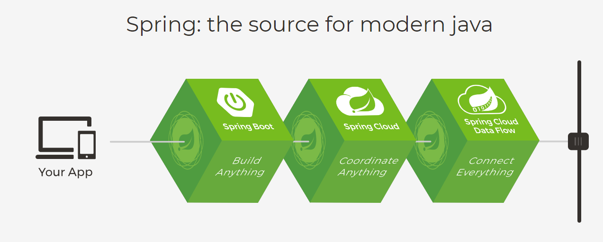
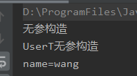
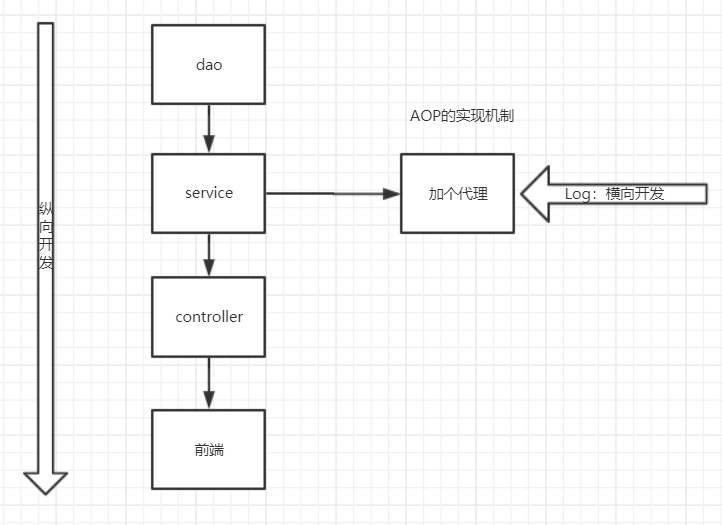
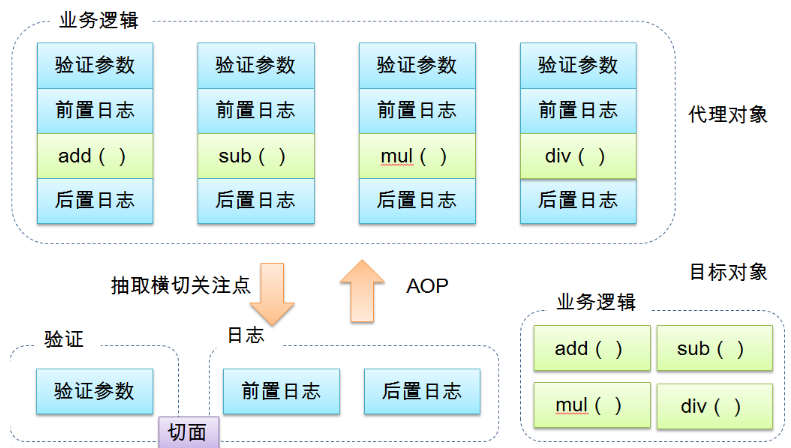
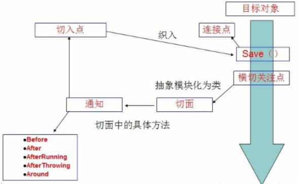
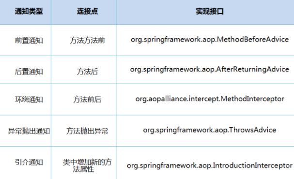

# 1、Spring

## 1.1、简介

Spring理念： 使现有技术更加容易使用，  本身是一个大杂烩， 整合了现有的技术框架。


SSH： Struts + Spring + Hibernate

SSM： SpringMVC + Spring + Mybatis


```xml
<!-- https://mvnrepository.com/artifact/org.springframework/spring-webmvc -->
<dependency>
    <groupId>org.springframework</groupId>
    <artifactId>spring-webmvc</artifactId>
    <version>5.2.0.RELEASE</version>
</dependency>

<dependency>
    <groupId>org.springframework</groupId>
    <artifactId>spring-jdbc</artifactId>
    <version>5.2.0.RELEASE</version>
</dependency>

```

## 1.2、优点

- Spring是一个开源的免费的框架（容器）
- Spring是一个轻量级的、非入侵式的框架（随便引入，不会影响原来的项目）
- **控制反转（IOC）， 面向切面编程（AOP）**
- 支持事务的处理， 对框架整合的支持！


总结一句话： ==Spring就是一个轻量级的控制反转（IOC）和面向切面编程（AOP）的框架！==


## 1.3、Spring的组成


## 1.4、拓展

在Spring的官网有这个介绍： 现代化的Java开发， 说白了就是基于Spring的开发

构建一切----->协调一切-------->连接一切




- Spring Boot
  - 一个快速开发的脚手架
  - 基于SpringBoot可以快速的开发单个微服务
  - 约定  大于  配置
- Spring Cloud
  - SpringCloud是基于SpringBoot实现的


因为现在大多数公司都在使用SpringBoot进行快速开发， 学习SpringBoot的前提， 需要完全掌握Spring及SpringMVC！  承上启下的作用！


弊端：发展太久了之后，违背了原来的理念！ 配置十分繁琐， 人称：“配置地狱”


# 2、IOC理论推导

1. UserDao 业务接口
2. UserDaoImpl 实现类
3. UserService 业务接口
4. UserServiceImpl 业务实现类


ServiceImpl中：

```java
private UserDao userDao = new UserDaoImpl();
```


在我们之前的业务中， 用户的需求可能会影响我们原来的代码， 我们需要根据用户的需求去修改原来的代码！

如果程序代码量十分大， 修改一次的成本代价十分昂贵！


我们使用一个Set接口实现， 已经发生了革命性变化

```java
private UserDao userDao;
//利用set进行动态实现值的注入！
public void setUserDao(UserDao userDao) {
    this.userDao = userDao;
}
```

- 之前，程序是主动创建对象，  控制权在程序员手上
- 使用了set注入之后， 程序不在具有主动性，而是变成了被动的接收对象


这种思想，从本质上解决了问题，我们程序员**不用再去管理对象的创建**了。系统的耦合性大大降低，可以更加专注的在业务的实现上！ 这是IOC的原型！


# 3、HelloSpring


**IOC本质**

**控制反转IoC(Inversion of Control)，是一种设计思想，DI(依赖注入)是实现IoC的一种方法**，也有人认为DI只是IoC的另一种说法。没有IoC的程序中 , 我们使用面向对象编程 , 对象的创建与对象间的依赖关系完全硬编码在程序中，对象的创建由程序自己控制，控制反转后将对象的创建转移给第三方，个人认为所谓控制反转就是：获得依赖对象的方式反转了。


采用XML方式配置Bean的时候，Bean的定义信息是和实现分离的，而采用注解的方式可以把两者合为一体，Bean的定义信息直接以注解的形式定义在实现类中，从而达到了零配置的目的。

**控制反转是一种通过描述（XML或注解）并通过第三方去生产或获取特定对象的方式。在Spring中实现控制反转的是IoC容器，其实现方法是依赖注入（Dependency Injection,DI）。**


**思考问题 ?**

- Hello 对象是谁创建的 ?

  hello 对象是由Spring创建的

- Hello 对象的属性是怎么设置的 ?

  hello 对象的属性是由Spring容器设置的 


这个过程就叫控制反转 :

控制 : 谁来控制对象的创建 , 传统应用程序的对象是由程序本身控制创建的 , 使用Spring后 , 对象是由Spring来创建的 .

反转 : 程序本身不创建对象 , 而变成被动的接收对象 .

依赖注入 : 就是利用set方法来进行注入的.

IOC是一种编程思想 , 由主动的编程变成被动的接收 .

可以通过newClassPathXmlApplicationContext去浏览一下底层源码 .

**OK , 到了现在 , 我们彻底不用再程序中去改动了 , 要实现不同的操作 , 只需要在xml配置文件中进行修改 , 所谓的IoC,一句话搞定 : 对象由Spring 来创建 , 管理 , 装配 !**


# 4、IOC创建对象的方式

1.使用无参构造，默认！

2.假设我们要使用有参构造方式

```xml
<bean id="exampleBean" class="examples.ExampleBean">
    <constructor-arg type="int" value="7500000"/>
    <constructor-arg type="java.lang.String" value="42"/>
</bean>
```


```xml
<bean id="exampleBean" class="examples.ExampleBean">
    <constructor-arg index="0" value="7500000"/>
    <constructor-arg index="1" value="42"/>
</bean>
```


```xml
<bean id="exampleBean" class="examples.ExampleBean">
    <constructor-arg name="years" value="7500000"/>
    <constructor-arg name="ultimateAnswer" value="42"/>
</bean>
```


==总结：在配置文件加载的时候， 容器中管理对象的对象就已经初始化了！   (每个对象都只有一份)==

```xml
<bean id="User" class="com.wang.pojo.User">
    <property name="name" value="wang"/>
</bean>
<bean id="User2" class="com.wang.pojo.UserT"/>
```

```java
ClassPathXmlApplicationContext context = new ClassPathXmlApplicationContext("beans.xml");
User user = (User) context.getBean("User");
user.show();
```




# 5、Spring配置


## 5.1、别名（alias）

起别名后原来的名字还能用


## 5.2、Bean的配置

```xml
<!--
id: bean 的唯一标识符， 也就是相当于我们学的对象名
class： bean对象所对应的全限定名：  包名+类型
name： 也是别名， 而且name可以同时取多个别名，  用逗号或者空格隔开
-->
    <bean id="User" class="com.wang.pojo.User" name="user2,u2,u3">
        <property name="name" value="wang"/>
    </bean>
```

## 5.3、import

一般用于团队开发使用，  它可以将多个配置文件，导入合并成一个


# 6、依赖注入（DI）

## 6.1、构造器注入

前面讲过

## 6.2、set方式注入

- 依赖注入： Set注入
  - 依赖：bean对象的创建依赖于容器
  - 注入：bean对象中的所有属性，由容器来注入


## 6.3、拓展方式注入


p命名空间

https://docs.spring.io/spring/docs/current/spring-framework-reference/core.html#beans-p-namespace

c命名空间

https://docs.spring.io/spring/docs/current/spring-framework-reference/core.html#beans-c-namespace


## 6.4、Bean的作用域

| Scope                                                        | Description                                                  |
| :----------------------------------------------------------- | :----------------------------------------------------------- |
| [singleton](https://docs.spring.io/spring/docs/current/spring-framework-reference/core.html#beans-factory-scopes-singleton) | (Default) Scopes a single bean definition to a single object instance for each Spring IoC container. |
| [prototype](https://docs.spring.io/spring/docs/current/spring-framework-reference/core.html#beans-factory-scopes-prototype) | Scopes a single bean definition to any number of object instances. |
| [request](https://docs.spring.io/spring/docs/current/spring-framework-reference/core.html#beans-factory-scopes-request) | Scopes a single bean definition to the lifecycle of a single HTTP request. That is, each HTTP request has its own instance of a bean created off the back of a single bean definition. Only valid in the context of a web-aware Spring `ApplicationContext`. |
| [session](https://docs.spring.io/spring/docs/current/spring-framework-reference/core.html#beans-factory-scopes-session) | Scopes a single bean definition to the lifecycle of an HTTP `Session`. Only valid in the context of a web-aware Spring `ApplicationContext`. |
| [application](https://docs.spring.io/spring/docs/current/spring-framework-reference/core.html#beans-factory-scopes-application) | Scopes a single bean definition to the lifecycle of a `ServletContext`. Only valid in the context of a web-aware Spring `ApplicationContext`. |
| [websocket](https://docs.spring.io/spring/docs/current/spring-framework-reference/web.html#websocket-stomp-websocket-scope) | Scopes a single bean definition to the lifecycle of a `WebSocket`. Only valid in the context of a web-aware Spring `ApplicationContext`. |


1.单例模式（默认）

```xml
<bean id="student" class="com.wang.pojo.Student" scope="singleton"/>
```


2.原型模式：每次从容器中get的时候， 都会产生一个新对象！

```xml
<bean id="accountService" class="com.something.DefaultAccountService" scope="singleton"/>
```


3.其余的request、session、application，这些只能在web开发中使用到！


# 7、Bean的自动装配

自动装配式Spring满足Bean依赖的一种方式

Spring会在上下文自动寻找，并自动给bean装配属性


在Spring中有三种装配方式

1.在xml中显式的配置

2.在java中显示的配置

3.隐式 的自动装配Bean【重要】


### 7.1、测试环境

***环境搭建：  一个人有两只宠物***

**1.新建三个实体类：Dog、Cat、Person**

```java
public class Cat {
    public void shout(){
        //猫会叫
        System.out.println("miao...");
    }
}
```

```java
public class Dog {
    public void shout(){
        //狗会叫
        System.out.println("wang...");
    }
}
```

```java
public class Person {
    //人有两只宠物 dog & cat
    private Dog dog;
    private Cat cat;
    private String name;

    public Dog getDog() {
        return dog;
    }

    public void setDog(Dog dog) {
        this.dog = dog;
    }

    public Cat getCat() {
        return cat;
    }

    public void setCat(Cat cat) {
        this.cat = cat;
    }

    public String getName() {
        return name;
    }

    public void setName(String name) {
        this.name = name;
    } 
    @Override
    public String toString() {
        return "Person{" +
                "dog=" + dog +
                ", cat=" + cat +
                ", name='" + name + '\'' +
                '}';
    }
}
```

**2.编写Spring配置文件， 注册<bean>**

```xml
<?xml version="1.0" encoding="UTF-8"?>
<beans xmlns="http://www.springframework.org/schema/beans"
       xmlns:xsi="http://www.w3.org/2001/XMLSchema-instance"
       xsi:schemaLocation="http://www.springframework.org/schema/beans
        https://www.springframework.org/schema/beans/spring-beans.xsd

    <bean id="dog" class="com.wang.pojo.Dog"/>
    <bean id="cat" class="com.wang.pojo.Cat"/>
                                            
    <bean id="person" class="com.wang.pojo.Person" autowire="byName">
        <property name="name" value="sasasasa"/>
	        <property name="cat" ref="cat"/>
	        <property name="dog" ref="dog"/>
    </bean>
</beans>
```

**3.测试搭建好的环境**

```java
public class MyTest {

    @Test
    public void test1(){
        ClassPathXmlApplicationContext context = new ClassPathXmlApplicationContext("beans.xml");

        Person person = (Person) context.getBean("person");
        person.getCat().shout();
        person.getDog().shout();
    }
}
```


### 7.2、byName自动装配

byName自动装配，顾名思义，就是**根据名称**自动装配。操作如下：

在Spring的配置文件中修改person的bean配置， 增加一个属性**autowire="byName"** 就可以了。

```xml
<!--    byName : 会自动在容器上下文中查找 和自己对象set方法后面的值对应的bean id-->
    <bean id="person" class="com.wang.pojo.Person" autowire="byName">
        <property name="name" value="sasasasa"/>
<!--        <property name="cat" ref="cat"/>-->
<!--        <property name="dog" ref="dog"/>-->
    </bean>
```

此时，我们就设置好了byName自动装配，Spring会自动在容器上下文寻找与 Person类中**Cat** cat和**Dog** dog两个属性的名称 相同的bean（即<bean id="cat">和<bean id="dog">）（**即，根据bean的id和Person的属性名称进行匹配**）进行匹配。

我们之前所配置的<property name="cat" ref="cat"/>和<property name="dog" ref="dog"/>就可以去掉了。

最后，再次进行测试，会出现与之前相同的输出结果。

**这里需要注意的是：需要保证name名称唯一，即不能出现两个<bean id="dog">**


### 7.3、byType自动装配

与byName自动装配类似，byType自动装配就是按照类型自动装配。操作如下：

在Spring的配置文件中修改person的bean配置， 增加一个属性**autowire="byType"** 

```xml
<!--    byName : 会自动在容器上下文中查找 和自己对象set方法后面的属性的类型对应的bean-->
    <bean id="person" class="com.wang.pojo.Person" autowire="byType">
        <property name="name" value="sasasasa"/>
<!--        <property name="cat" ref="cat"/>-->
<!--        <property name="dog" ref="dog"/>-->

    </bean>
```


此时，我们就设置好了byType自动装配，Spring会自动在容器上下文寻找与 Person类中**Cat** cat和**Dog** dog两个属性的类型（**class**）相同的bean（即<bean id="xxx" class="com.wang.pojo.Cat">和<bean id="xxx" class="com.wang.pojo.Dog">）进行匹配。

**注：需保证这个type只有一个**


### 7.4、使用注解实现自动装配【推荐】

#### **7.4.1、实验准备**

**1.在原来基础上引入文件头：** 

```xml
xmlns:context="http://www.springframework.org/schema/context"
http://www.springframework.org/schema/context
https://www.springframework.org/schema/context/spring-context.xsd">
```

**2.配置注解的支持：**

```xml
<context:annotation-config/>
```

**3.最终效果如下：**

```xml
<?xml version="1.0" encoding="UTF-8"?>
<beans xmlns="http://www.springframework.org/schema/beans"
    xmlns:xsi="http://www.w3.org/2001/XMLSchema-instance"
    xmlns:context="http://www.springframework.org/schema/context"
    xsi:schemaLocation="http://www.springframework.org/schema/beans
        https://www.springframework.org/schema/beans/spring-beans.xsd
        http://www.springframework.org/schema/context
        https://www.springframework.org/schema/context/spring-context.xsd">

    <context:annotation-config/>

</beans>
```


#### **7.4.2、@Autowired**

- @Autowired是按类型自动转配的，不支持id匹配。
- 需要导入spring-aop的包

直接在属性上使用即可， 也可以在set方法上使用

使用Autowired我们可以不用编写set方法了， 前提是你这个自动装配的属性在IOC（Spring）容器中存在（即属性的<bean> 存在）。

**1.使用@Autowired注解**

```java
public class Person {
    @Autowired
    private Dog dog;
    @Autowired
    private Cat cat;
    private String name;
    ……………………
}
```


**2.此时的spring配置文件应为：**

```xml
<?xml version="1.0" encoding="UTF-8"?>
<beans xmlns="http://www.springframework.org/schema/beans"
       xmlns:xsi="http://www.w3.org/2001/XMLSchema-instance"
       xmlns:context="http://www.springframework.org/schema/context"
       xsi:schemaLocation="http://www.springframework.org/schema/beans
        https://www.springframework.org/schema/beans/spring-beans.xsd
        http://www.springframework.org/schema/context
        https://www.springframework.org/schema/context/spring-context.xsd">

    <context:annotation-config/>

    <bean id="dog" class="com.wang.pojo.Dog"/>
    <bean id="cat" class="com.wang.pojo.Cat"/>
    <bean id="person" class="com.wang.pojo.Person"/>

</beans>
```

**3.测试，输出效果与一开始相同**


**【注】@Autowired(required=false) ：required默认为true，即对象必须存对象，不能为null，如果设为false，则对象可以为null；**


**@Qualifier**

- **@Autowired**是**根据类型自动装配**的，**加上@Qualifier**则可以**根据byName**的方式**自动装配**
- @Qualifier不能单独使用。

操作步骤：

1.修改配置文件内容

```xml
<bean id="dog1" class="com.kuang.pojo.Dog"/>
<bean id="dog2" class="com.kuang.pojo.Dog"/>
<bean id="cat1" class="com.kuang.pojo.Cat"/>
<bean id="cat2" class="com.kuang.pojo.Cat"/>
```

2.没有加Qualifier测试，报错

3.在属性上加上@Qualifier注解

```java
@Autowired
@Qualifier(value = "cat2")
private Cat cat;
@Autowired
@Qualifier(value = "dog2")
private Dog dog;
```

4.再次测试，成功

**说明：**

如果@Autowired自动装配的环境比较复杂， 自动装配无法通过一个注释@Autowired完成的时候， 我们可以使用@Qualifier(value="xxx")去配置@Autowired的使用，指定一个bean对象注入


#### **7.4.3、@Resource**

- @Resource如有指定的name属性，先按该属性进行byName方式查找装配；
- 其次再进行默认的byName方式进行装配；
- 如果以上都不成功，则按byType的方式自动装配。
- 都不成功，则报异常。


#### 7.4.4@Resource 和 @Autowired 的区别

- 都是用来自动装配的
- @Autowired通过byType的方式实现， 而且必须要求这个对象存在！ 【常用】
- @Resource默认通过byName方式实现， 如果找不到名字， 则通过byType方式实现！ 如果两个都找不到的情况下，就报错！ 【常用】
- 执行顺序不同：


# 8、使用注解开发

在Spring4之后， 要使用注解开发， 必须保证aop的包导入


使用注解需要导入context

1.bean


2.属性如何注入

```java
//加上这个注解 等价于  <bean id="user" class="com.wang.pojo.User"/>
//@Component 组件
@Component
public class User {
    // 这个注解相当于 bean里面的<property name="" value="">
    @Value("wang")
    public String name;
}
```


3.衍生的注解

@Component有几个衍生注解， 我们在web开发中， 会按照mvc三层架构分层！

- dao【@repository】

- service【@Service】

- controller【@Controller】

  这四个注解的功能都是一样的， 都是代表将某个类注册到Spring中，装配Bean


4.自动装配注解

@Autowired

@Nullable

@Resource


5.作用域

@Scope("singleton")


6.小结

 xml与注解：

- ​	xml更加万能，适用于任何场合！ 维护简单方便
- ​	注解 不是自己类使用不了，维护相对复杂

xml 与 注解最佳实践：

- xml用来管理Bean；
- 注解只负责完成属性的注入；
- 我们在使用的过程中，只需要注意一个问题：必须让注解生效，就需要开启注解支持

```xml
<!--    指定要扫描的包， 这个包下的注解就会生效-->
    <context:component-scan base-package="com.wang"/>
    <context:annotation-config/>
```


# 9、使用java的方式去配置Spring

实体类：

```java

import org.springframework.beans.factory.annotation.Value;
import org.springframework.stereotype.Component;

@Component
public class User {
    private String name;

    public String getName() {
        return name;
    }

    @Value("hh")
    public void setName(String name) {
        this.name = name;
    }

    @Override
    public String toString() {
        return "User{" +
                "name='" + name + '\'' +
                '}';
    }
}
```


配置类：

```java
import com.wang.pojo.User;
import org.springframework.context.annotation.Bean;
import org.springframework.context.annotation.ComponentScan;
import org.springframework.context.annotation.Configuration;


//这个也会被Spring容器托管， 注册到容器中， 因为它本身就是一个 @Component
//@Configuration代表这是一个配置类， 就和我们之前看的beans.xml
@Configuration
@ComponentScan("com.wang.pojo")
public class mConfig {

    //注册一个bean， 就相当于我们之前写的一个bean标签
    //这个方法的名字， 就相当于bean标签中的id属性
    //这个方法的返回值， 就相当于bean标签中的class属性
    @Bean
    public User getUser(){
        return new User();
    }
}
```

测试类：

```java

import com.wang.config.mConfig;
import com.wang.pojo.User;
import org.springframework.context.annotation.AnnotationConfigApplicationContext;

public class test {

    public static void main(String[] args) {
        //如果完全使用了配置类方式去做， 我们就只能通过 AnnotationConfig 上下文来获取容器， 通过配置类的class对象加载！
        AnnotationConfigApplicationContext context = new AnnotationConfigApplicationContext(mConfig.class);
        User getUser = (User) context.getBean("getUser");
        System.out.println(getUser.getName());
    }
}
```


这种纯java的配置方式， 在SpringBoot中随处可见！


# 10、代理模式

为什么要学习代理模式？  因为这就是SpringAOP的底层 【SpringAOP 和 SpringMVC】

代理模式的分类

- 静态代理模式
- 动态代理模式

## 10.1、静态代理

角色分析：

- 抽象角色：一般会使用接口或者抽象类来解决
- 真实角色：被代理角色
- 代理角色：代理真实角色，代理真实角色后，我们一般会做一些附属操作
- 客户：访问代理对象的人！


代码步骤：

1.接口

```java
public interface Rent {
    void rent();
}
```

2.真实角色

```java
public class Host implements Rent {
    public void rent() {
        System.out.println("房东要出租房子");
    }
}
```

3.代理角色

```java
public class Proxy implements Rent{

    private Host host;
    public Proxy(){

    }
    public Proxy(Host host){
        this.host = host;
    }
    public void rent() {
        seeHouse();
        host.rent();
        hetong();
        fare();
    }
    //看房
    public void seeHouse(){
        System.out.println("中介带你看房");
    }
    public void hetong(){
        System.out.println("签租赁合同");
    }
    //收中介费
    public void fare(){
        System.out.println("收中介费");
    }
}
```

4.客户端访问代理角色

```java
public class Client {
    public static void main(String[] args) {
        //房东要租房子
        Host host = new Host();
        //代理， 中介帮房东租房子， 但是呢？ 代理一般会有一些附属操作！
        Proxy proxy = new Proxy(host);

        //你不用找房东， 直接找中介租房即可！
        proxy.rent();
    }
}
```

代理模式的好处：

- 可以使真实角色的操作更加纯粹！ 不用去关注一些公共的业务
- 公共也就交给代理角色，  实现了业务的分工
- 公共业务发生扩展的时候， 方便集中管理


缺点：

- 一个真实角色就会产生一个代理角色； 代码量会翻倍  开发效率会变低


#### 加深理解

接口：

```java
public interface UserService {
    void add();
    void delete();
    void update();
    void query();
}
```


实现类：

```java
public class UserServiceImpl implements UserService {
    public void add() {
        System.out.println("使用了add方法");
    }

    public void delete() {
        System.out.println("使用了delete方法");
    }

    public void update() {
        System.out.println("使用了update方法");
    }

    public void query() {
        System.out.println("使用了query方法");
    }
}
```

访问：

```java
public class Client {
    public static void main(String[] args) {

        //以前增删改查
        UserService userService = new UserServiceImpl();

        userService.add();
    }
}
```


现根据业务需求的扩大， 需要在service层增加log。为了保证原来的代码的正常运行， 我们不能去修改原来的代码。

为了达到我们的目的，我们可以在原来的基础上增加一个代理模式，在代理角色在实现原来功能的基础上，再去实现我们新的需求log。

这也就是AOP的实现机制

**代理角色：**

```java
public class UserServiceProxy implements UserService {
    private UserService userService;

    public void setUserService(UserService userService){
        this.userService = userService;
    }

    public void add() {
        log("add");
        this.userService.add();

    }

    public void delete() {
        log("delete");
        this.userService.delete();
    }

    public void update() {

        log("update");
        this.userService.update();
    }

    public void query() {

        log("query");
        this.userService.query();
    }

    private void log(String msg){
        System.out.println("[DEBUG] " + msg);
    }
}
```

**客户端调用：**

```java
public class Client {
    public static void main(String[] args) {

        //以前增删改查
        UserService userService = new UserServiceImpl();
        
        //代理角色
        UserServiceProxy userServiceProxy = new UserServiceProxy();
        userServiceProxy.setUserService(userService);
        userServiceProxy.add();
    }
}
```




## 10.2、动态代理

- 动态代理和静态代理角色一样
- 动态代理的代理类是动态生成的，不是我们直接写好的
- 动态代理分为两类：基于接口的动态代理， 基于类的动态代理
  - 基于接口----JDK动态代理【我们在这里使用的】
  - 基于类：cglib
  - java字节码实现： JAVAsist


需要了解两个类 ： Proxy： 代理， InvocationHandler


动态代理的好处：

- 静态代理的好处 全都有
- 一个动态代理类**代理的是一个接口**， 一般就是对应的**一类业务**
- 一个动态代理可以代理多个类， 只要是实现了同一个接口即可


# 11、AOP

## 11.1、什么是AOP

**AOP（Aspect Oriented Programming）**意为：面向切面编程，通过预编译方式和运行期动态代理实现程序功能的统一维护的一种技术。AOP是OOP的延续，是软件开发中的一个热点，也是Spring框架中的一个重要内容，是函数式编程的一种衍生范型。利用AOP可以对业务逻辑的各个部分进行隔离，从而使得业务逻辑各部分之间的耦合度降低，提高程序的可重用性，同时提高了开发的效率。





## 11.2、AOP在Spring中的作用


- 横切关注点：跨越应用程序多个模块的方法或功能。即是，与我们业务逻辑无关的，但是我们需要关注的部分，就是横切关注点。如日志 , 安全 , 缓存 , 事务等等 ....
- 切面（ASPECT）：横切关注点 被模块化 的特殊对象。即，它是一个类。  --------> LOG
- 通知（Advice）：切面必须要完成的工作。即，它是类中的一个方法。     ---------->LOG中的方法
- 目标（Target）：被通知对象。
- 代理（Proxy）：向目标对象应用通知之后创建的对象。
- 切入点（PointCut）：切面通知 执行的 “地点”的定义。
- 连接点（JointPoint）：与切入点匹配的执行点。




SpringAOP中，通过Advice定义横切逻辑，Spring中支持5种类型的Advice:




```xml
<!-- https://mvnrepository.com/artifact/org.aspectj/aspectjweaver -->
<dependency>
    <groupId>org.aspectj</groupId>
    <artifactId>aspectjweaver</artifactId>
    <version>1.9.3</version>
</dependency>
```

方式一： 使用Spring API实现【主要SpringAPI接口实现】


方式二： 自定义类实现 AOP【主要是切面定义】


方式三：使用注解实现


# 12、整合Mybaitis


步骤： 

1.导入相关jar包

2.配置


maven依赖：

```xml
<dependencies>

    <dependency>
        <groupId>junit</groupId>
        <artifactId>junit</artifactId>
        <version>4.12</version>
    </dependency>
    <dependency>
        <groupId>mysql</groupId>
        <artifactId>mysql-connector-java</artifactId>
        <version>5.1.45</version>
    </dependency>

    <dependency>
        <groupId>org.mybatis</groupId>
        <artifactId>mybatis</artifactId>
        <version>3.5.2</version>
    </dependency>

    <dependency>
        <groupId>org.springframework</groupId>
        <artifactId>spring-webmvc</artifactId>
        <version>5.2.0.RELEASE</version>
    </dependency>

    <!-- https://mvnrepository.com/artifact/org.springframework/spring-jdbc -->
    <dependency>
        <groupId>org.springframework</groupId>
        <artifactId>spring-jdbc</artifactId>
        <version>5.2.0.RELEASE</version>
    </dependency>
    <!-- https://mvnrepository.com/artifact/org.aspectj/aspectjweaver -->
<dependency>
    <groupId>org.aspectj</groupId>
    <artifactId>aspectjweaver</artifactId>
    <version>1.9.3</version>
</dependency>

    <!-- https://mvnrepository.com/artifact/org.mybatis/mybatis-spring -->
    <dependency>
        <groupId>org.mybatis</groupId>
        <artifactId>mybatis-spring</artifactId>
        <version>2.0.2</version>
    </dependency>


</dependencies>
```


```xml
<?xml version="1.0" encoding="UTF-8"?>
<beans xmlns="http://www.springframework.org/schema/beans"
       xmlns:xsi="http://www.w3.org/2001/XMLSchema-instance"
       xsi:schemaLocation="http://www.springframework.org/schema/beans
        https://www.springframework.org/schema/beans/spring-beans.xsd">

<!--DataSource:使用Spring的数据源替换Mybatis的配置,还有c3p0、dbcp、druid-->
    <bean id="dataSource" class="org.springframework.jdbc.datasource.DriverManagerDataSource">
        <property name="driverClassName" value="com.mysql.jdbc.Driver"/>
        <property name="url" value="jdbc:mysql://localhost:3306/mybatis?/useUnicoude=true&amp;characterEncoding=utf-8&amp;useSSL=false"/>
        <property name="username" value="root"/>
        <property name="password" value="123456"/>
    </bean>

<!--sqlSessionFactory-->
    <bean id="sqlSessionFactory" class="org.mybatis.spring.SqlSessionFactoryBean">
        <property name="dataSource" ref="dataSource" />
<!--绑定Mybatis配置文件-->
        <property name="configLocation" value="classpath:mybatis-config.xml"/>
        <property name="mapperLocations" value="classpath:com/wang/mapper/*.xml"/>
    </bean>


<!--SqlSessionTemplate就是我们在Mybaitis使用的sqlSession-->
    <bean id="sqlSession" class="org.mybatis.spring.SqlSessionTemplate">
<!--只能使用构造器注入sqlSessionFactory， 因为它没有set方法-->
        <constructor-arg index="0" ref="sqlSessionFactory"/>
    </bean>

    <bean id="userMapper" class="com.wang.mapper.UserMapperImpl">
        <property name="sqlSession" ref="sqlSession"/>
    </bean>

</beans>
```


1.编写数据源配置

2.sqlSessionFactory

3.sqlSessionTemplate

4.需要给接口加实现类【】

5.将自己写的实现类，注入到Spring中，

6.测试使用即可


# 13、声明式事务

## 13.1 回顾事务

- 把一组事务当成一个业务来做；要么都成功，要么都失败
- 事务在项目开发中，十分重要，涉及到数据一致性问题
- 确保完整性和一致性


事务ACID原则：

- 原子性
- 一致性
- 隔离性
  - 多个业务可能操作同一个资源， 防止数据损坏
- 持久性
  - 事务一旦提交，无论系统发生什么问题，结果都不会再受影响，被持久化的写到存储器中！


## 13.2、spring中的事务管理


- 声明式事务： AOP 【我们通常使用AOP的方式加入事务】


1.配置声明式事务：

```xml
<bean id="transactionManager" class="org.springframework.jdbc.datasource.DataSourceTransactionManager">
    <constructor-arg ref="dataSource"/>
</bean>
```
2.结合AOP实现事务的织入， 配置事务通知

//给哪些方法配置事务

```xml
<tx:advice id="txAdvice" transaction-manager="transactionManager">
    <tx:attributes>
        <tx:method name="add" propagation="REQUIRED"/>
        <tx:method name="delete"/>
        <tx:method name="update"/>
        <tx:method name="select" read-only="true"/>
        <tx:method name="*"/>
    </tx:attributes>
</tx:advice>
```
3.配置事务切入

```xml
<aop:config>
    <aop:pointcut id="txPointCut" expression="execution(* com.wang.mapper.*.*(..))"/>
    <aop:advisor advice-ref="txAdvice" pointcut-ref="txPointCut"/>
</aop:config>
```


总的配置如下：

```xml
    <bean id="transactionManager" class="org.springframework.jdbc.datasource.DataSourceTransactionManager">
        <constructor-arg ref="dataSource"/>
    </bean>

    <tx:advice id="txAdvice" transaction-manager="transactionManager">
        <tx:attributes>
            <tx:method name="add" propagation="REQUIRED"/>
            <tx:method name="delete"/>
            <tx:method name="update"/>
            <tx:method name="select" read-only="true"/>
            <tx:method name="*"/>
        </tx:attributes>
    </tx:advice>

    <aop:config>
        <aop:pointcut id="txPointCut" expression="execution(* com.wang.mapper.*.*(..))"/>
        <aop:advisor advice-ref="txAdvice" pointcut-ref="txPointCut"/>
    </aop:config>
```


- 编程式事务： 需要在代码中，进行事务管理

